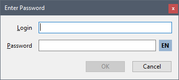

Lazarus Keyboard Layout
=======================

What is it?
-----------

I once tried to create a convenient login window for users who have more than one keyboard layout. This is a very common situation when an user forgets to switch the layout before entering a login or password. The OS-wide keyboard layout indicator is usually located in the corner of the screen, and the user must look here before typing. This is inconvenient, so I wanted to add the indicator to the login window itself so that it is in the front of the user's eyes.

Also, this is cross-platform application (Windows + GNU/Linux) written in FreePascal / Lazarus and the indicator should work on both families of operating systems.

A core of it's algorithm is a cross-platform class `TKeyboardLayoutIndicator` (Windows + GNU/Linux, I think, it should also work on all OSes with X11 and XKB support like FreeBSD) which keeps track of keyboard layout switching, reads the current keyboard locale from the OS in human-readable form ('US', 'RU', etc.) and writes it with an event handler `OnUpdateIndicator`:

``` delphi
TIndicatorEvent = procedure(LayoutText: string) of object;

TKeyboardLayoutIndicator = class
public
    // Constructor and destructor
    constructor Create;
    destructor Destroy; override;

    // Start keyboard layout watching
    procedure StartWatching;

    // Stop keyboard layout watching
    procedure StopWatching;

    // Update indicator event
    property OnUpdateIndicator: TIndicatorEvent read FOnUpdateIndicator write FOnUpdateIndicator; 
end;
```

How it works?
-------------
On Windows, it uses system hooks to intercept keyboard layout changes.

On GNU/Linux, it works more tricky: creates a separate thread to capture X keyboard events.

Files
-----
The module `keyboardlayout.pas` contains the `TKeyboardLayoutIndicator` class and the auxiliary code necessary for its operation. I tested it on Windows 10 and ALT Linux 10.

Folder `demo` belong to the demo project that illustrates the use of this procedure.

Dependencies
------------
It doesn't require anything special to compile the code other than the standard LCL package. Tested on Lazarus 2.2.4 and 2.2.6, should work on earlier (more or less modern) and later versions.

On GNU/Linux, it requires the X11 subsystem to run.

Demo
----
The demo project can be compiled under both Windows and GNU/Linux (the left screenshot is from Windows 10, the right one is from ALT Linux 10 with GNOME shell).

The `TfrmEnterPassword` form and all the code used here is part of my actual cross-platform working project.

 

Delphi compatibility
--------------------
The `keyboardlayout.pas` file must also be compatible with Delphi (but I haven't tested it). To use it with Delphi on Windows, remove the `{$mode ObjFPC}{$H+}` line, all `{$IF defined(WINDOWS)}` lines, and all lines between the associated `{$ELSE}` and `{$ENDIF}`, including themselves, and all `{$IF not defined(WINDOWS)}`...`{$ENDIF}` blocks. You may also need to fix the module names in the section `uses` (depending on the version of Delphi).

The demo project is incompatible with Delphi due to different form formats (`dfm` / `lfm`) and the use of some Lazarus-specific properties. You can recreate the form and use the corrected source code as explained above.

Known issues
------------
I have not tested the class in a console application. On GNU/Linux, the X event mechanism may not work because there must be a window that receives the events.

On Windows, creating multiple instances of the `TKeyboardLayoutIndicator` class is pointless due to a system hook using a global variable containing an instance of this class. If you need more than one indicator in your application, please think of something to hold a list of them and use the single `OnUpdateIndicator` event handler. Or modify the `TKeyboardLayoutIndicator` class to create a list of event handlers instead of a single `OnUpdateIndicator`.

On Windows, the class reads the two-letter (or three-letter in some exotic cases) locale name abbreviation from the OS using `GetLocaleInfo` function according to the ISO-639 standard. On GNU/Linux, it takes the full language name (e.g. 'english') and returns the first two letters from it. Thus, on some layouts the indicator will return different names. If someone knows how to do it more elegant way, please tell me.

It would be nice to add support for macOS, but I just don't have a Mac.

Author
------
Copyright (c) 2023, Michael Demidov

Visit my GitHub page to check for updates, report issues, etc.: https://github.com/MichaelDemidov

Drop me an e-mail at: michael.v.demidov@gmail.com
